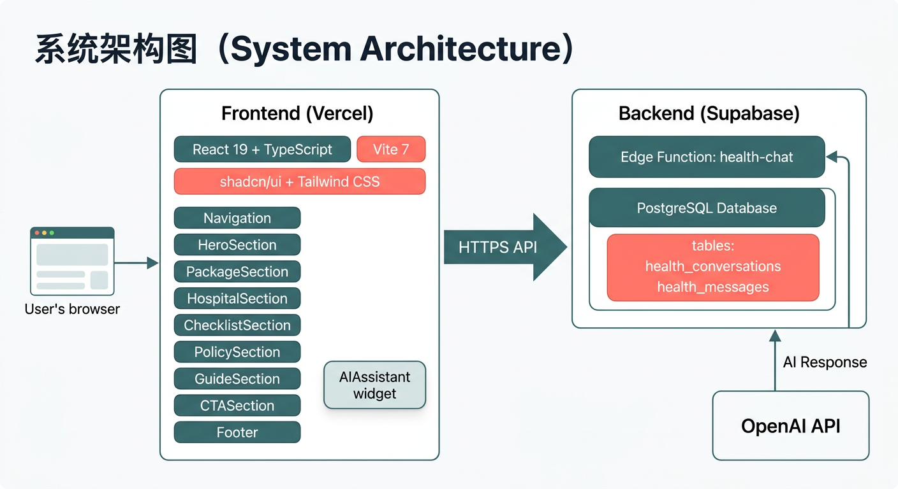
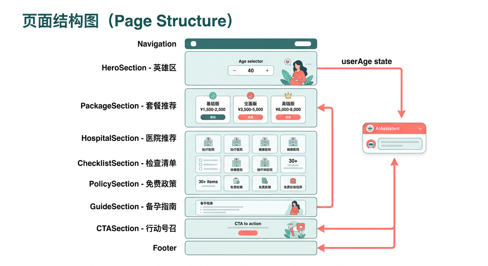
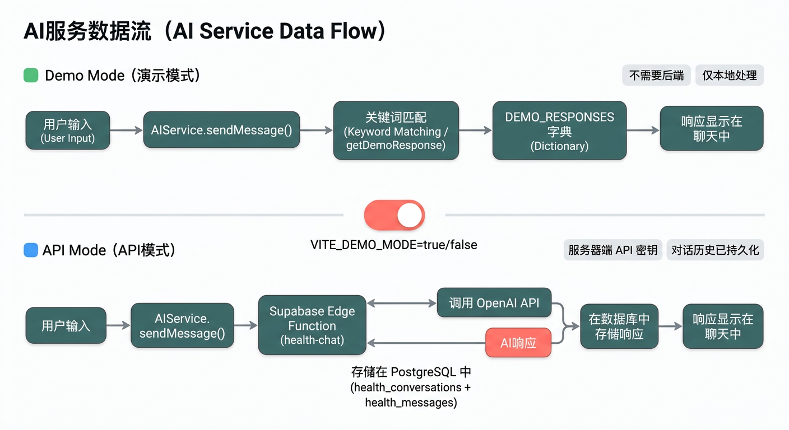

# 上海备孕体检指南

为备孕女性量身定制的全面体检方案网站，涵盖医院推荐、体检套餐、项目清单、免费政策和AI智能助手。

**在线访问**: [https://app-neon-six-62.vercel.app](https://app-neon-six-62.vercel.app)


## 功能特色

- **智能年龄推荐** — 根据年龄（25-40岁）自动推荐适合的体检套餐
- **AI备孕顾问** — 浮动聊天助手，解答医学术语、体检项目、备孕准备等问题
- **上海8家医院推荐** — 专科、综合、平价三类医院详情对比
- **30+体检项目清单** — 可勾选的互动式检查项目列表
- **免费孕前检查政策** — 上海免费政策申请流程和条件详解
- **医学术语词典** — 20+常见术语（AMH、TORCH、性激素六项等）悬浮解释

|  |  |
|:---:|:---:|
| 三档套餐智能推荐 | AI备孕顾问聊天 |

## 系统架构



### 技术栈

| 层级 | 技术 |
|------|------|
| 前端框架 | React 19 + TypeScript |
| 构建工具 | Vite 7 |
| UI组件库 | shadcn/ui (40+ 组件) + Tailwind CSS v3 |
| 后端服务 | Supabase Edge Functions (Deno) |
| 数据库 | Supabase PostgreSQL |
| 部署 | Vercel (前端) + Supabase (后端) |
| AI模型 | OpenAI GPT-3.5-turbo (可配置) |

### 前端页面结构



单页滚动应用，由9个区块组件组成。全局状态仅 `userAge` 一个，从 `HeroSection` 的年龄选择器传递到需要个性化推荐的子组件。

### AI服务数据流



支持两种运行模式：
- **演示模式**（默认）— 本地关键词匹配，无需后端，7个预设话题的即时回复
- **API模式** — 通过 Supabase Edge Function 调用 OpenAI，对话历史持久化存储

## 快速开始

```bash
# 克隆并安装
git clone <repo-url>
cd health-agent/app
npm install

# 启动开发服务器
npm run dev
```

默认以演示模式运行，无需任何后端配置即可体验全部功能。

### 启用真实AI

1. 在 Supabase 控制台设置 Edge Function Secret: `OPENAI_API_KEY`
2. 配置环境变量：

```env
VITE_SUPABASE_URL=your_supabase_url
VITE_SUPABASE_ANON_KEY=your_anon_key
VITE_DEMO_MODE=false
```

## 项目结构

```
health-agent/
├── app/                          # 前端应用 (Vite项目根目录)
│   ├── src/
│   │   ├── components/
│   │   │   ├── ui/               # shadcn/ui 组件库 (40+)
│   │   │   ├── AIAssistant.tsx   # AI聊天助手浮窗
│   │   │   ├── AgeSelector.tsx   # 年龄选择器
│   │   │   └── MedicalTerm.tsx   # 医学术语悬浮解释
│   │   ├── sections/
│   │   │   ├── Navigation.tsx    # 顶部导航栏
│   │   │   ├── HeroSection.tsx   # 英雄区 + 年龄选择
│   │   │   ├── PackageSection.tsx# 体检套餐推荐 (3档)
│   │   │   ├── HospitalSection.tsx# 医院推荐 (8家)
│   │   │   ├── ChecklistSection.tsx# 体检项目清单
│   │   │   ├── PolicySection.tsx # 免费政策指南
│   │   │   ├── GuideSection.tsx  # 备孕指南
│   │   │   ├── CTASection.tsx    # 行动号召
│   │   │   └── Footer.tsx        # 页脚
│   │   ├── services/
│   │   │   ├── aiConfig.ts       # AI配置 + 医学术语库 + 年龄段数据
│   │   │   ├── aiService.ts      # AI服务层 (演示/API双模式)
│   │   │   └── supabase.ts       # Supabase客户端初始化
│   │   ├── App.tsx               # 根组件
│   │   └── main.tsx              # 入口文件
│   ├── vercel.json               # Vercel部署配置
│   └── package.json
├── docs/
│   └── images/                   # 架构图示
├── screenshots/                  # 网站截图
├── CLAUDE.md                     # 开发指南 (Claude Code)
└── README.md
```

## 体检套餐数据

| 套餐 | 价格范围 | 适合年龄 | 核心项目 |
|------|----------|----------|----------|
| 基础版 | ¥1,500-2,500 | 25-28岁 | 血常规、尿常规、肝肾功能、妇科B超、白带常规、TORCH |
| 全面版 | ¥3,500-5,000 | 29-35岁 | 基础版 + AMH、性激素六项、甲状腺功能、TCT+HPV |
| 高端版 | ¥6,000-8,000 | 36岁以上 | 全面版 + 染色体核型、遗传病筛查、免疫抗体全套 |

## 医院推荐

| 医院 | 类型 | 特点 |
|------|------|------|
| 红房子医院 | 专科 | 妇产科国内顶尖 |
| 国妇婴 | 专科 | 生殖医学知名 |
| 一妇婴 | 专科 | 辅助生殖技术领先 |
| 仁济医院 | 综合 | 综合实力强 |
| 瑞金医院 | 综合 | 内分泌科权威 |
| 曙光医院 | 综合 | 中西医结合 |
| 第四人民医院 | 平价 | 性价比高 |
| 妇幼保健所 | 平价 | 免费检查定点 |

## 开发命令

```bash
cd app
npm run dev       # 启动开发服务器 (Vite HMR)
npm run build     # 类型检查 + 生产构建
npm run lint      # ESLint检查
npm run preview   # 预览生产构建
```

## 部署

### Vercel (前端)

Vercel 自动部署，根目录设置为 `app`。需配置环境变量：
- `VITE_SUPABASE_URL`
- `VITE_SUPABASE_ANON_KEY`
- `VITE_DEMO_MODE=false`

### Supabase (后端)

- Edge Function `health-chat` 处理AI对话
- PostgreSQL 存储对话历史 (`health_conversations`, `health_messages`)
- Dashboard -> Edge Functions -> Secrets 中设置 `OPENAI_API_KEY`

## 许可证

MIT
