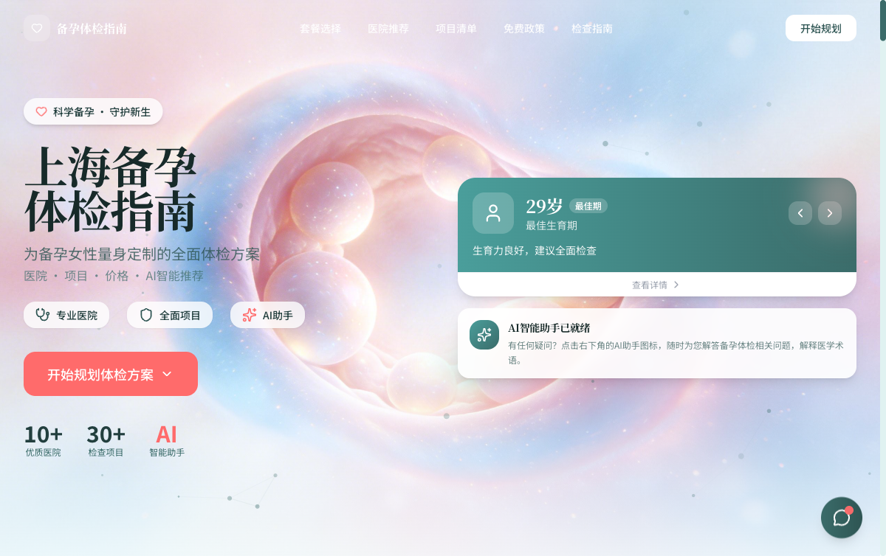
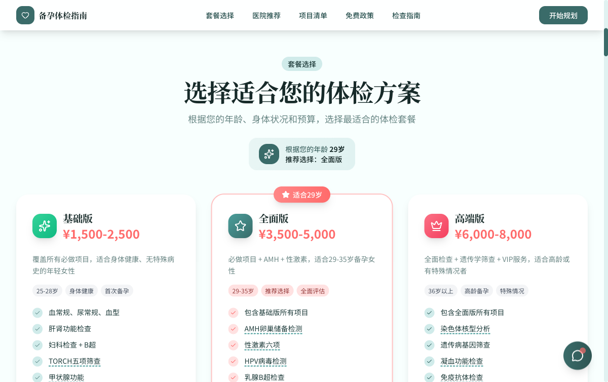
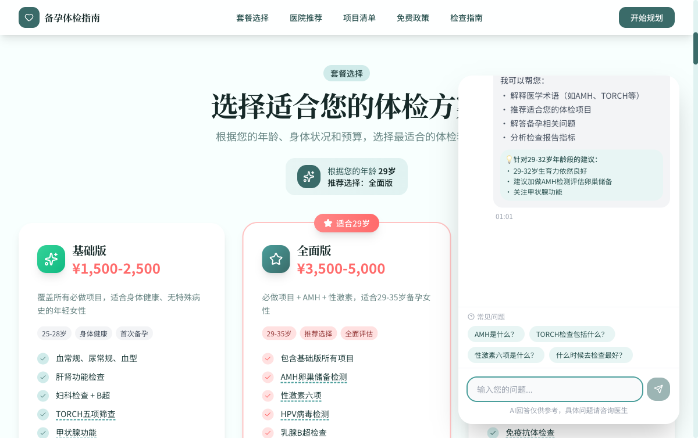

# 上海备孕体检指南

为备孕女性量身定制的全面体检方案网站，涵盖医院推荐、体检套餐、项目清单、免费政策和AI智能助手。

**在线访问**: [https://app-neon-six-62.vercel.app](https://app-neon-six-62.vercel.app)

## 截图

### 首页


### 套餐选择（根据年龄智能推荐）


### AI备孕顾问


## 功能特色

- **智能年龄推荐** — 根据用户年龄（25-40岁）推荐最适合的体检套餐和重点关注项目
- **AI备孕顾问** — 内置AI聊天助手，解释医学术语（AMH、TORCH、性激素六项等），解答备孕问题
- **医院推荐** — 精选上海8家优质体检医院，含价格、评分、特色对比
- **项目清单** — 30+体检项目分类整理（必做/建议/选做），含价格参考
- **免费政策** — 上海免费孕前检查申请流程、条件、各区办理方式
- **检查指南** — 最佳检查时间、注意事项、必带物品清单
- **医学术语词典** — 悬浮提示解释专业术语，降低理解门槛

## 技术栈

- **前端**: React 19 + TypeScript + Vite 7
- **UI**: shadcn/ui + Tailwind CSS v3 + Lucide Icons
- **后端**: Supabase Edge Functions (Deno) + PostgreSQL
- **AI**: OpenAI-compatible Chat API（服务端代理，密钥不暴露）
- **部署**: Vercel（前端）+ Supabase（后端）

## 快速开始

```bash
cd app
npm install
npm run dev
```

默认以演示模式运行（AI助手使用预设回复，无需后端配置）。

### 启用AI后端

1. 在 Supabase 项目中配置 `OPENAI_API_KEY` secret
2. 创建 `.env.local`：

```env
VITE_SUPABASE_URL=https://your-project.supabase.co
VITE_SUPABASE_ANON_KEY=your_anon_key
VITE_DEMO_MODE=false
```

## 项目结构

```
app/
├── src/
│   ├── components/     # 通用组件（AIAssistant, AgeSelector, MedicalTerm, ui/）
│   ├── sections/       # 页面区块（Hero, Package, Hospital, Checklist, Policy, Guide, CTA）
│   ├── services/       # AI服务层（aiService, aiConfig, supabase）
│   └── App.tsx         # 主页面入口
├── vercel.json         # Vercel 部署配置
└── package.json
```

## 构建

```bash
npm run build    # TypeScript 类型检查 + Vite 生产构建
npm run lint     # ESLint 检查
npm run preview  # 本地预览生产构建
```
